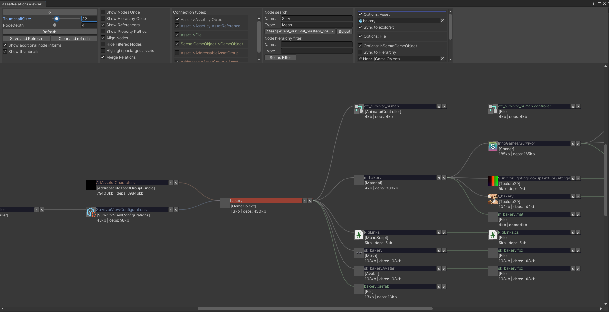
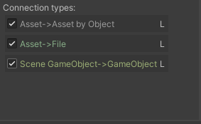
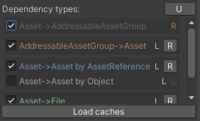
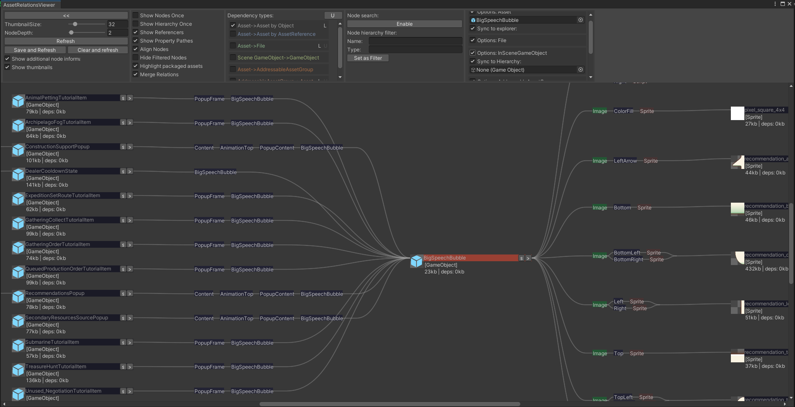
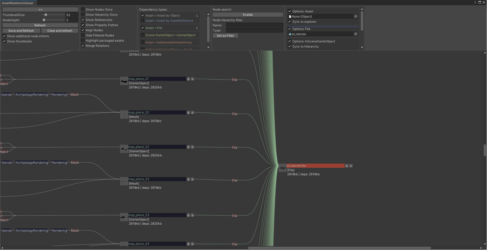
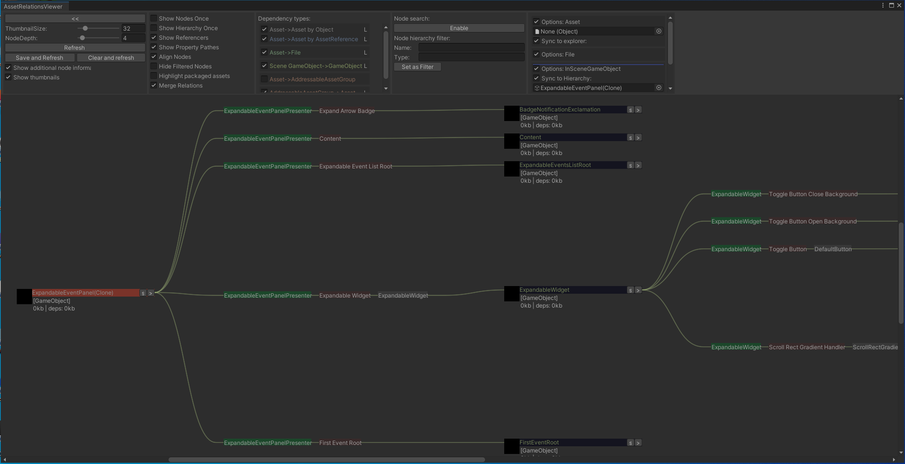
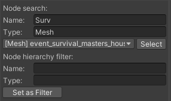
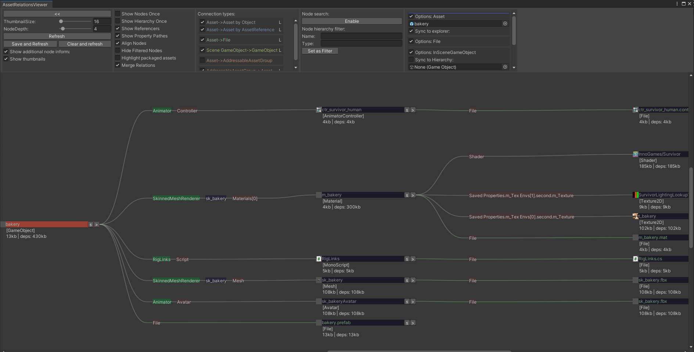

# Asset Relations Viewer

Plugin to display dependencies between assets, files, assetgroups, etc. in a tree based view within the Unity editor.



- [Features](#features)
- [Installation](#installation)
- [First Usage](#first-usage)
- [Controls](#controls)
- [Dependency type list](#dependency-type-list)
  * [Dependency types](#dependency-types)
  * [Caching](#caching)
- [Node search and filter](#node-search-and-filter)
- [Showing dependency pathes](#showing-dependency-pathes)
- [Node handlers](#node-handlers)
- [Troubleshooting](#troubleshooting)
- [Standalone dependency cache](#standalone-dependency-cache)
- [Addons](#addons)

<br><br><br><br>
## Features

* Standalone Editor UI without any external dependencies
* View which dependencies an asset has to other assets
* View which assets have the given asset as a dependency
* Show thumbnails of all assets in the dependency tree
* filter for Asset Names and Asset Types in displayed tree
* Highlight if an asset is used in the project (going to be packed in the app)
* Show path of where an asset is used exactly within a scene, prefab or asset
* Display byte size of compressed asset together with overall size of dependency tree
* Extendable by own dependency resolvers, for example to show addressables
* Support additional connection- and nodetypes which can be added via addons, for example:
	* Addressable Groups
	* Addressables
	* AssetBundles
	* LocaKeys
	* AssemblyDefinitions
	* Etc.

<br><br><br><br>

## Installation

#### For Unity 2018.3 or later (Using Unity Package Manager)

Find the manifest.json file in the packages folder of your project and edit it to look like this:
```js
{
  "dependencies": {
    "com.innogames.asset-relations-viewer": "https://github.com/innogames/asset-relations-viewer.git",
    ...
  },
}
```

If you are in production and not want to get automatic updates always use a tagged version like:

```js
	...
    "com.innogames.asset-relations-viewer": "https://github.com/innogames/asset-relations-viewer.git#VERSION_TAG",
    ...

```

<br><br><br><br>
## First Usage

1. Select an asset within the unity project explorer
2. Right click to open context menu for an asset
3. Select "Show in Asset Relations Viewer"
4. On Dialog for the first startup of AssetRelationsViewer click on yes
5. Wait for the resolver to find all dependencies for all assets in the project which can take a while for a large project with many assets

<br><br><br><br>
## Controls

#### Menu items

Menu items sorted from left to right

<br>

**Back button ("<<")**: Button to go back to previous selected asset to view <br/>
**Thumbnail Size**: Size of the thumbnails in pixels <br/>
**Node Depth**: Depth of the shown tree structure <br/>
**Refresh**: Updates dependencies and refreshes view after asset has changed <br/>
**Save and Refresh**: Saves the project before refresh <br/>
**Clear and Refresh**: Clears cache before refresh to force a complete rebuild of all caches <br/>
**Show additional node information **: Displays size and also type of the nodes <br/>
**Show Thumbnails**: Shows correct thumbnails on nodes if available <br/>
**Show nodes Once**: To only show each node (Asset) once within the displayed tree <br/>
**Show hierarchy Once**: To only show the same dependency hierarchy for a node once within the displayed tree <br/>
**Show referencers**: If referencers (Assets that have the selected asset as a dependency) should be shown or not <br/>
**Show Property Pathes**: Shows path of dependency (GameObject->Components->ClassMemberVariable) <br/>
**Align Nodes**: If all nodes of the same depth should be aligned horizontally in the displayed tree  <br/>
**Hide Filtered Nodes**: Hide all nodes that are filtered out instead of just graying them out <br/>
**Highlight packaged assets**: Adds green highlight to nodes which are going to be packed into the app (Are actually used by the game) <br/>
**Merge Relations**: If a node has the same asset as a dependency multiple times, the same dependency is just shown once <br/>


#### Node


**s**: If the selected node is an asset, it will be selected in the unity project explorer <br/>
**>**: Sets node as currently selected node <br/>

<br><br><br><br>

# Dependency type list
The AssetRelationViewer can display several types of dependencies. In order for them to show up these need to be selected first.



After selecting a dependency type that is currently not loaded the <b>Load caches</b> button need to be clicked on in order to finally load the dependency types. <br/>
Unused dependency types can be unloaded by clicking on the <b>U</b> button.



**L** Dependency type is active and currently loaded <br/>
**R** Dependency type got activated but needs to be loaded <br/>
**U** Dependency type got deactivated and can be unloaded <br/>
**R Button** Refreshes the dependencies just for this dependency type

## Dependency types

### Asset->Asset by Object
Dependencies of assets to assets by a UnityEngine.Object reference.



### Asset->File
Dependencies of assets to the file they are part of. <br/>
This is required since a file can have several subassets meaning that an asset is not automatically the file itself even though most files only contain a single asset. <br/>
Note: Only the file itself has size information about the assets it contains. So in order to get size information with the "Show additional node information" this dependecy type need to be enabled <br/>



### Scene GameObject->GameObject
Dependencies of GameObject to GameObjects within the currently loaded scene or prefab. <br/>
If an in scene GameObject is selected as the viewed node only GameObject->GameObject dependencies are shown. The GameObject->GameObject dependency view can not be viewed together with other dependencies. <br/>
Note: If the opened scene/prefab changed after opening the AssetRelationViewer the cache needs to be refreshed. <br/> 



### AsmDef->AsmDef
Dependencies between AssemblyDefinitions to other AssemblyDefinitions as well as AssemblyDefinitionReferences to AssemblyDefinitions


## Caching
Most dependency types are cached to only update the dependencies again if the file itself got changed. <br/> 
This greatly reduces the startup time of the AssetRelationsViewer since for large projects finding all Asset->Asset dependencies can take several minutes.
If a file needs to be updated is currently determinined by the timestamp of the file but could be changed to in addition also take a file hash into account.

### Location
The caches are stored in PROJECT_ROOT/NodeDependencyCache. <br/> 
Dependending on the projectsize these files can be several several megabytes in size. <br/> 
The NodeDependencyCache folder should be added to .gitignore and not be checked in into the git repository.

### Clearing the cache
The cache files can either be deleted manually or inside Unity under the Window/Node Dependency Cache/Clear Cache Files menu item.


<br><br><br><br>
# Node search and filter


## Node search
Since every type of node can be viewed in the AssetRelationViewer like Assets, Files, AddressableAssetGroups, AsmDefs, etc. is sometime helpful to have a generic node search.<br/>
Because finding all nodes in the projects might take a while this feature needs to be activated first by clicking on the "Enable" botton.<br/>
Only known nodes based on the activated dependency types are shown, meaning that if for example no asset related dependency type is active no assets can be found in the node search. <br/>
Nodes can be searched for by name and by type. <br/>
Based on the filtered name and type the dropdown will show all available nodes to select. <br/>
Once selected in the dropdown the current node can be shown in the AssetRelationsViewer by clicking <b>Select</b>. <br/>

## Node hierarchy filter
To specifically filter for either a node name or node type the "Node hierarchy filter:" can be used. <br/>
Only the matching nodes will be highlighted and all others are grayed out. <br/>
In the example the dependency tree is filtered for "vertexLit". <br/>


<br><br><br><br>
# Showing dependency pathes

In the AssetRelationsViewer it is possible to not only view dependencies between Asset->Asset for example but also exactly through with path the dependency exist. <br/>
In order to view the pathes "Show Property Pathes" needs to be activated. <br/>
Once active the whole path of the dependency (GameObject->Components->ClassMemberVariable) is shown in the hierarchy tree view. <br/>



# Node handlers
GUI options specific to a node type. <br/>


## Asset
Options specific to Assets. <br/>

Contains dropdown to select an asset in the project. <br/>
**Sync to explorer**: If selected the currently selected asset in the project explorer will be the one shown in the AssetRelationsViewer. <br/>

## File
Options specific to Files. <br/>
Currently there are no specific options for them. <br/>

## InSceneGameObject
Options for in scene GameObjects. <br/>

Contains dropdown to select a GameObject from the currently opened scene/prefab. <br/>
**Sync to hierarchy**: If selected the currently selected GameObject in the currently opened scene/prefab will be shown in the AssetRelationsViewer. <br/>

<br><br><br><br>
# Troubleshooting
There can be cases where no tree is shown in the AssetRelationsViewer

* Make sure a node (Asset) is selected to be shown
* Make sure a dependency cache (AssetDependencyCache) and dependency resolver (ObjectDependencyResolver) is selected, otherwise no dependency can be found
* After a code recompile the dependency cache needs to be updated by clicking on "Refresh"
* Some dependency types might not update/work correctly when being in PlayMode
* There might be some rare cases where the cache didnt get updated correctly. If there are dependencies missing which you are sure should be displayed sometimes also complete cache rebuild with a <b>Clean and Refresh</b> can help.

<br><br><br><br>
# Standalone dependency cache
The dependency cache can be used without the AssetRelationsViewer. <br/>
This makes it possible to use the cache for other tools where dependency information between assets, files, etc. is required. <br/>
In the following example we find out which asset have a dependency on the BaseProductions prefab.

```c#
NodeDependencyLookupContext context = new NodeDependencyLookupContext();
ResolverUsageDefinitionList resolverList = new ResolverUsageDefinitionList();

resolverList.Add<AssetDependencyCache, ObjectSerializedDependencyResolver>(true, true, true);
resolverList.Add<AssetToFileDependencyCache, AssetToFileDependencyResolver>(true, true, true);

NodeDependencyLookupUtility.LoadDependencyLookupForCaches(context, resolverList);

// Get guid for BaseProductions prefab
string[] assetGuids = AssetDatabase.FindAssets("t:prefab BaseProductions");

// Nodehandlers to get further information about nodes like the name, type, size, etc.
AssetNodeHandler assetNodeHandler = new AssetNodeHandler();

// Get the node for the file
Node node = context.RelationsLookup.GetNode(assetGuids[0], FileNodeType.Name);

// Iterate over all referencers of the file (assets)
foreach (Connection referencer in node.Referencers)
{
	if (referencer.Node.Type == AssetNodeType.Name)
	{
		// Get name and type of asset
		assetNodeHandler.GetNameAndType(referencer.Node.Id, out string nodeName, out string nodeType);
		
		foreach (Connection assetreferencer in referencer.Node.Referencers)
		{
			assetNodeHandler.GetNameAndType(assetreferencer.Node.Id, out string refNodeName, out string refNodeType);
			
			Debug.LogWarning($"[{nodeType}]{nodeName} is directly referenced by [{refNodeType}]{refNodeName}");
		}
	}
}
```

Executing this would result in the following output <br/>
<b>[GameObject]BaseProductions is directly referenced by [GameObject]ProductionTabContent</b>

For this script to work in your own project the name and type of the asset in AssetDatabase.FindAssets() needs to be adapted accordingly to an asset that exists in your project.

<br><br><br><br>
# Addons
Support to display different connection and node types can be added by addons.

## Addressable system
An addon is available to add support for showing addressables and also addressable groups from Unitys Addressables system. <br/>
The Package is called asset-relations-viewer-addressables. <br/>
It can be found at https://github.com/innogames/asset-relations-viewer-addressables <br/>

## Writing own addons to support custom connection- and nodetypes
Own addons can be also added so custom dependencies with any nodetype and dependency type can be added to be viewed inside the Asset Relations Viewer. <br/>
For seing how to add own addons, please have a look at the Addressable sytem addon source code. <br/>

